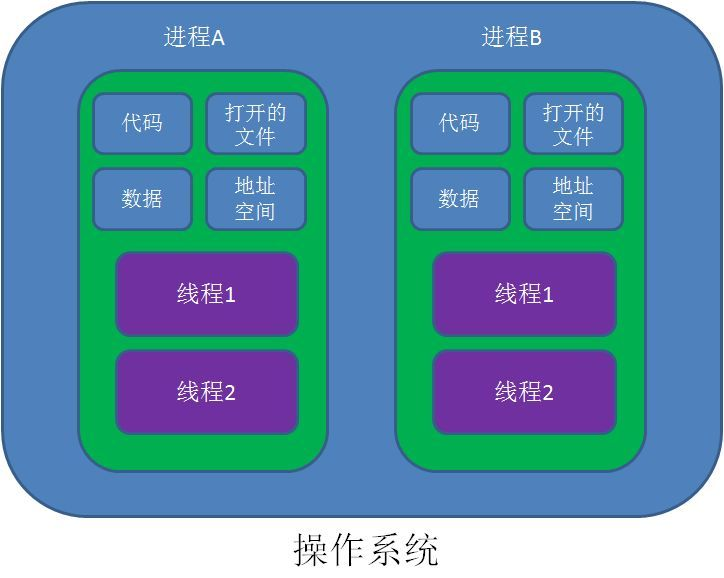
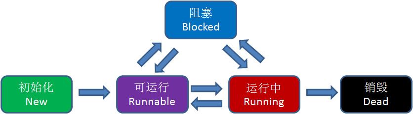
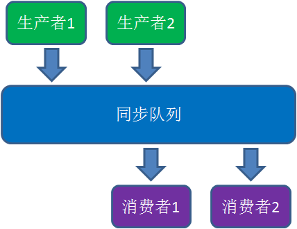

# 协程
## 怎么理解协程

我们先来把协程这个概念搞懂，不是很好理解，但是也不难理解

**协程** - 也叫微线程，是一种新的多任务并发的操作手段(也不是很新，概念早就有了)

* 特征：协程是运行在单线程中的并发程序
* 优点：省去了传统 Thread 多线程并发机制中切换线程时带来的线程上下文切换、线程状态切换、Thread 初始化上的性能损耗，能大幅度唐提高并发性能

下面是关于协程这个概念的一些描述：

>协程的开发人员 Roman Elizarov 是这样描述协程的：协程就像非常轻量级的线程。线程是由系统调度的，线程切换或线程阻塞的开销都比较大。而协程依赖于线程，但是协程挂起时不需要阻塞线程，几乎是无代价的，协程是由开发者控制的。所以协程也像用户态的线程，非常轻量级，一个线程中可以创建任意个协程。
Coroutine，翻译成”协程“，初始碰到的人马上就会跟进程和线程两个概念联系起来。直接先说区别，Coroutine是编译器级的，Process和Thread是操作系统级的。Coroutine的实现，通常是对某个语言做相应的提议，然后通过后成编译器标准，然后编译器厂商来实现该机制。Process和Thread看起来也在语言层次，但是内生原理却是操作系统先有这个东西，然后通过一定的API暴露给用户使用，两者在这里有不同。Process和Thread是os通过调度算法，保存当前的上下文，然后从上次暂停的地方再次开始计算，重新开始的地方不可预期，每次CPU计算的指令数量和代码跑过的CPU时间是相关的，跑到os分配的cpu时间到达后就会被os强制挂起。Coroutine是编译器的魔术，通过插入相关的代码使得代码段能够实现分段式的执行，重新开始的地方是yield关键字指定的，一次一定会跑到一个yield对应的地方
对于多线程应用，CPU通过切片的方式来切换线程间的执行，线程切换时需要耗时（保存状态，下次继续）。协程，则只使用一个线程，在一个线程中规定某个代码块执行顺序。协程能保留上一次调用时的状态，不需要像线程一样用回调函数，所以性能上会有提升。缺点是本质是个单线程，不能利用到单个CPU的多个核

### 什么是进程和线程

有一定基础的小伙伴们肯定都知道进程和线程。

进程是什么呢？

直白地讲，进程就是应用程序的启动实例。比如我们运行一个游戏，打开一个软件，就是开启了一个进程。

进程拥有代码和打开的文件资源、数据资源、独立的内存空间。

线程又是什么呢？

线程从属于进程，是程序的实际执行者。一个进程至少包含一个主线程，也可以有更多的子线程。

线程拥有自己的栈空间。

有人给出了很好的归纳：

对操作系统来说，线程是最小的执行单元，进程是最小的资源管理单元。

无论进程还是线程，都是由操作系统所管理的。

Java中线程具有五种状态：

初始化

可运行

运行中

阻塞

销毁

这五种状态的转化关系如下：

但是，线程不同状态之间的转化是谁来实现的呢？是JVM吗？

并不是。JVM需要通过操作系统内核中的TCB（Thread Control Block）模块来改变线程的状态，这一过程需要耗费一定的CPU资源。

### 进程和线程的痛点

线程之间是如何进行协作的呢？

最经典的例子就是生产者/消费者模式：

若干个生产者线程向队列中写入数据，若干个消费者线程从队列中消费数据。

如何用java语言实现生产者/消费者模式呢？

让我们来看一看代码：

	public class ProducerConsumerTest {
	
		public static void main(String args[]) {
			final Queue<Integer> sharedQueue = new LinkedList();
			Thread producer = new Producer(sharedQueue);
			Thread consumer = new Consumer(sharedQueue);
			producer.start();
			consumer.start();
		}
		
	}
	
	class Producer extends Thread {
	
		private static final int MAX_QUEUE_SIZE = 5;
		private final Queue sharedQueue;
		
		public Producer(Queue sharedQueue) {
			super();
			this.sharedQueue = sharedQueue;
		}
		
		@Override
		public void run() {
			for (int i = 0; i < 100; i++) {
				synchronized (sharedQueue) {
					while (sharedQueue.size() >= MAX_QUEUE_SIZE) {
						System.out.println("队列满了，等待消费");
						try {
							sharedQueue.wait();
						} catch (InterruptedException e) {
							e.printStackTrace();
						}
					}
					sharedQueue.add(i);
					System.out.println("进行生产 : " + i);
					sharedQueue.notify();
				}
			}
		}
	}
	
	class Consumer extends Thread {
		private final Queue sharedQueue;
		
		public Consumer(Queue sharedQueue) {
			super();
			this.sharedQueue = sharedQueue;
		}
		
		@Override
		public void run() {
			while(true) {
				synchronized (sharedQueue) {
					while (sharedQueue.size() == 0) {
						try {
							System.out.println("队列空了，等待生产");
							sharedQueue.wait();
						} catch (InterruptedException e) {
							e.printStackTrace();
						}
					}
					int number = sharedQueue.poll();
					System.out.println("进行消费 : " + number );
					sharedQueue.notify();
				}
			}
		}
	}

这段代码做了下面几件事：

1.定义了一个生产者类，一个消费者类。

2.生产者类循环100次，向同步队列当中插入数据。

3.消费者循环监听同步队列，当队列有数据时拉取数据。

4.如果队列满了（达到5个元素），生产者阻塞。

5.如果队列空了，消费者阻塞。

上面的代码正确地实现了生产者/消费者模式，但是却并不是一个高性能的实现。为什么性能不高呢？原因如下：

1.涉及到同步锁。

2.涉及到线程阻塞状态和可运行状态之间的切换。

3.涉及到线程上下文的切换。

以上涉及到的任何一点，都是非常耗费性能的操作。

什么是协程

协程，英文Coroutines，是一种比线程更加轻量级的存在。正如一个进程可以拥有多个线程一样，一个线程也可以拥有多个协程。

